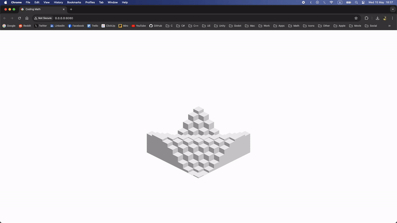
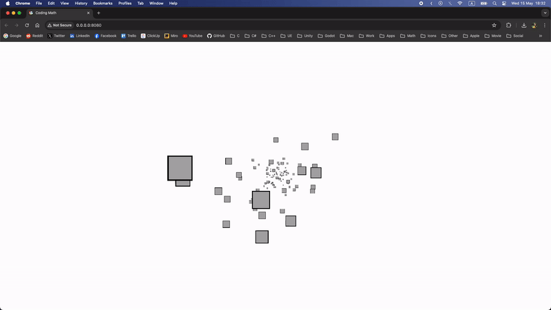
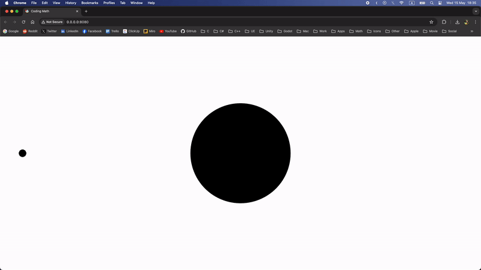
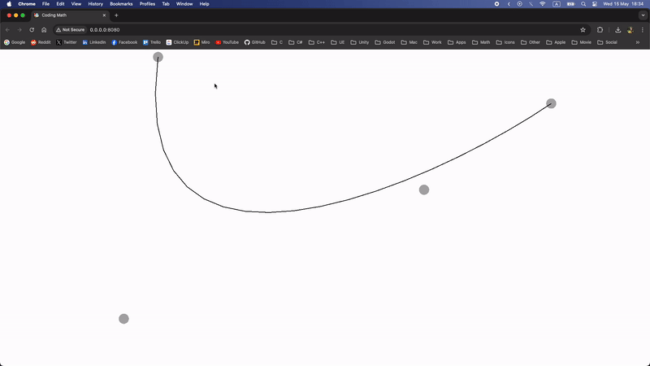
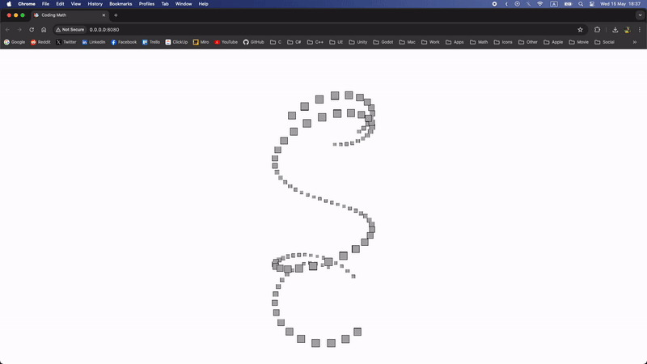

# Coding Math Examples with PhacerCE

Developed by [Davit Badalyan](https://github.com/davit-badalyan)

## Table of Contents

- [About](#about)
- [Examples](#examples)
- [Getting Started](#getting-started)
- [Preview](#preview)
- [License](#license)

## <a name="about"></a> About

Welcome to the "coding-math" repository! This project contains math examples developed with PhacerCE, inspired by tutorials from [Coding Math](https://www.youtube.com/@codingmath). The examples have been recreated and adapted by [Davit Badalyan](https://github.com/davit-badalyan) for educational and portfolio purposes.

## <a name="examples"></a> Examples

Explore a variety of math examples implemented with PhacerCE. Each example provides a practical demonstration of mathematical concepts and can be used for educational purposes or as a reference for real-world applications.

## <a name="getting-started"></a> Getting Started

To dive into the examples and learn more about the mathematical concepts, follow these simple steps:

1. **Clone the Repository**
   ```bash
   git clone https://github.com/your-digital-research/coding-math.git
   ```
2. **Navigate to the Project directory**
   ```bash
   cd Project/
   ```
3. **Install Node Modules**
   ```bash
   npm install
   ```
4. **Install Node Version**
   ```bash
   nvm install 16
   ```
5. **Set Node Version**
   ```bash
   nvm use 16
   ```
6. **Start the Project**
   ```bash
   npm start
   ```
7. **Open in Browser**
   - Open your preferred web browser and navigate to the specified address (typically http://localhost:8080 or http://0.0.0.0:8080/).
8. **To Change Example**
   - Open **board-view.js**
   - Change **\_buildExample()** function by assigning new example to **this.\_example**
9. **Examples Location**
   - Examples are located in **src/view/examples** directory

## <a name="preview"></a> Preview

<p align="center">
  
</p>

<p align="center">
  
</p>

<p align="center">
  
</p>

<p align="center">
  
</p>

<p align="center">
  
</p>

<p align="center">
  
</p>

<p align="center">
  
</p>

## <a name="license"></a> License

This repository is licensed under the [MIT License](https://opensource.org/license/mit/). Feel free to use and adapt the examples for your own projects.

Feel free to contribute, open issues, or provide feedback.

Happy coding!
